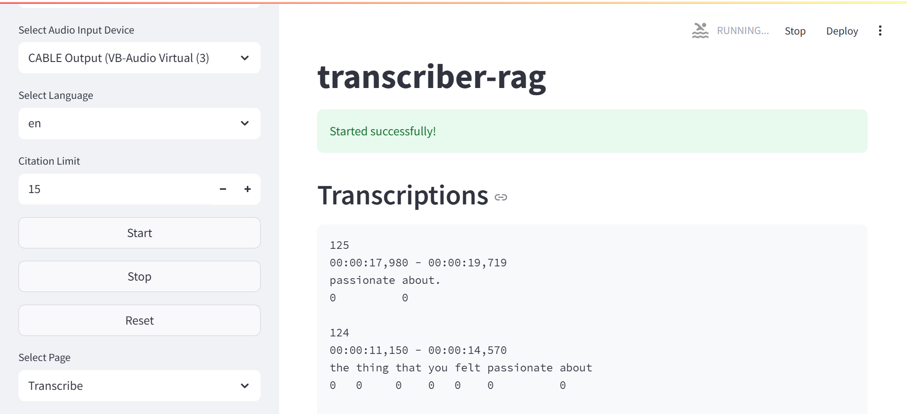
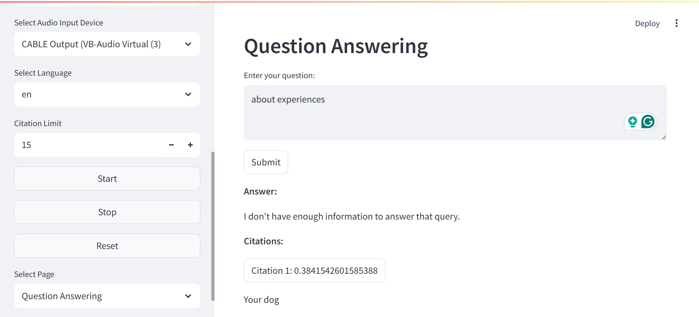

# transcriber-rag

> A simple voice transcriber with RAG application using Deepgram and LangChain.

## Features

- Real-time voice transcriber directly from a microphone or speaker using Deepgram.
- Transcription data is used by RAG (retrieval augmented generation) to answer user queries.
- The RAG implementation is using LangChain with Milvus, Cohere, and Google AI.
- The application user interface is created with Streamlit.

## Tutorial

### 1. Install the dependencies.

```bash
uv pip install -e . -U
```

### 2. Run the app.

```bash
streamlit run app.py
```

### 3. Sidebar configurations.

- Input API credentials.
- Input settings.
- Select one of the feature pages:
    - **Transcribe**: Real-time voice transcription.
    - **Question and Answer**: Answering queries based on transcription.
- Optionally, click "Reset" button to clear the data.

### 5. Transcribe.

- Click on the "Start" button to start transcribing.
- Click on the "Stop" button to stop transcribing.

### 6. Question and Answer.

- Input your query in the text box.
- Click on the "Submit" button.
- Click citation button to view citation details.

## Demonstration


