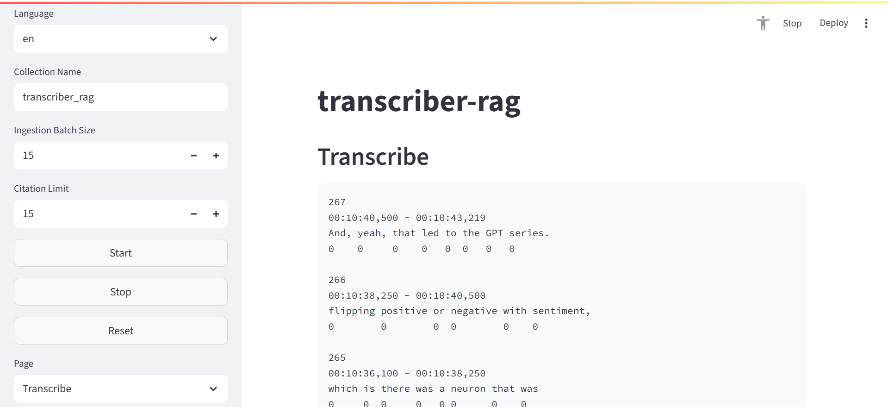
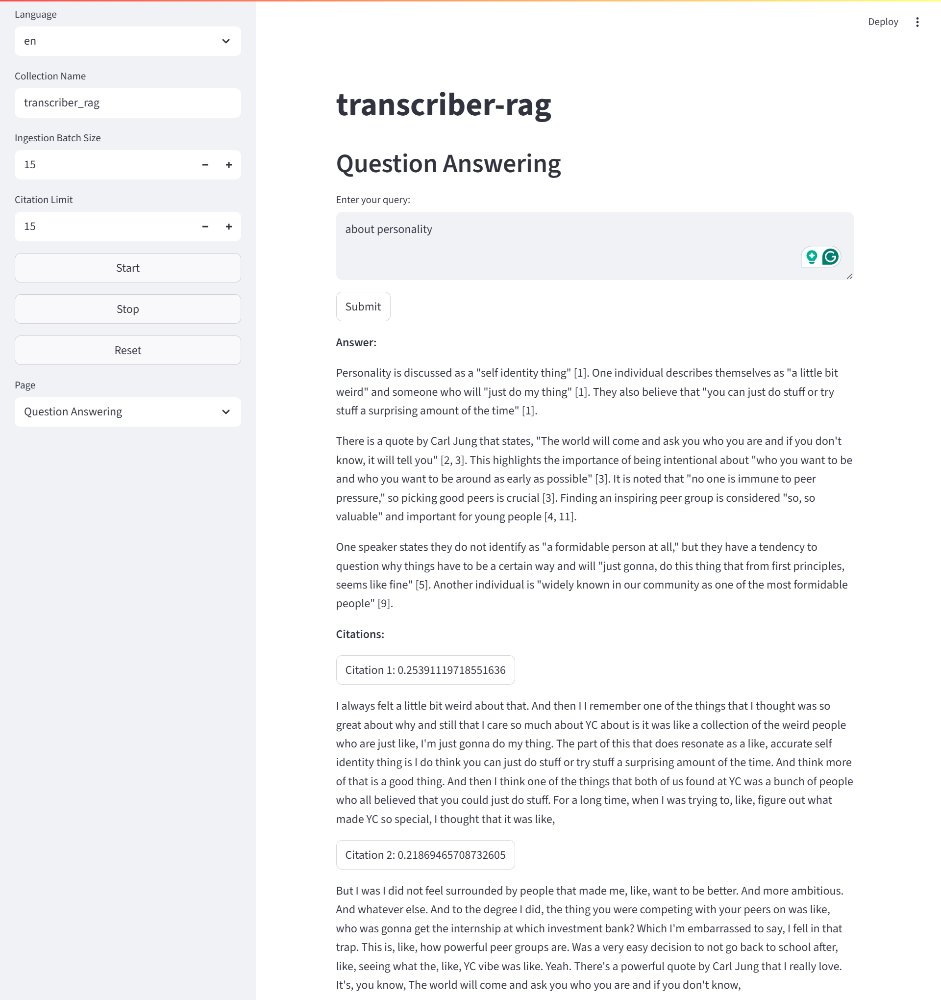

# transcriber-rag

> A simple voice transcriber with RAG application using Deepgram and LangChain.

## Tutorial

### 1. Install the dependencies.

```bash
uv pip install -e . -U
```

### 2. Apply configurations.

### 3. Run the app.

```bash
streamlit run app.py
```

## Demonstration


